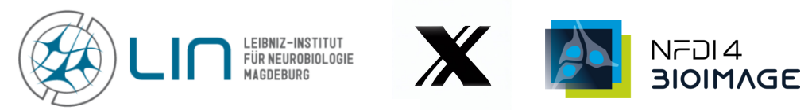

# dmtxSampleCreator
- browser extension: reads datamatrix code (not other kind of codes) from camera and either link to an already existing sample entry or create a sample in an inventory and paste the link into an text field in rspace ELN (for other ELN read [Roadmap](README.md#roadmap-priority-15)

## how to use
- edit a basic document
- open a iframe (i.e. regular custom field) inside the iframe
- mark the place where you want to insert the link with the cursor (blinking text cursor)
- click the "link sample" button in the top-left corner the browser camera should open in front of the ELN (camera connection maybe have to be allowed once)
- present datamatrix code in front of the camera (a sharp image is more important than the size of the code within the image)
- click the "record" button below the "link sample" button
- the link should be paste at cursor position 
- the description of the pasted link clearly shows if it was a datamatrix code previously assigned to a sample or if it was just created
[practical example](example/tutorial_example.md)

## dependencies (incomplete, use environment.yml for full list)
- Python >= 3.10
- Flask >= 2.2.2
- Fask-Cors >= 3.0.10
- requests >= 2.31.0
- pylibdmtx >= 0.1.10

## configuration/ secret file
- fill the api_secrets.example file and rename it to .json
[api_secrets.example](/data/secrets/api_secrets.example)

## version history
### 0.1
- first full working version (public release)
- known bug: it doesn't read the cursor position precise enough, so better to use at the end or the beginning of a field
- known bug: if a datamatrix code is being used more then once it only paste the link to the first entry found (what should happen if there's more then one entry connected to one datamatrix code? paste all codes? even if there're plenty?)

## Roadmap/ TODO in no particular order ;) (Priority [1..5])
- **[5]**: paste the Link to the precise cursor position no matter what element the cursor is in (i.e. if there're to many p or td elements it doesn't really work)
- **[4]:** show frame sent to server after pushing record button instead of the video stream (maybe show a frame surrounding the decoded matrix code)
- **[4]:** show a error texts if something unusal happen (especially a warning if the a user tried to add a link without being inside an iframe; no active iframe = nothing can be paste into an active iframe)
- **[4]**: use the userName transmitted from the client to create samples not the API username (in the final version samples will be created by the admin, so the created username should be the one who initiate the creation of the sample) 
- **[3]**: package the extension to use it as regular extension
- **[3]**: show a progress/ waiting bar
- **[3]**: create a final server structure to be used instead of "non SSL flask development server"
- **[2]:** improve visability of record button
- **[2]**: add eLabFTW support
- **[1]**: improve folder structure/ refactoring
- **[1]**: include another decoder to also decode other kind of codes like QR codes and barcodes
- **[1]**: add batch-scan possibility (function depends on user feedback)

